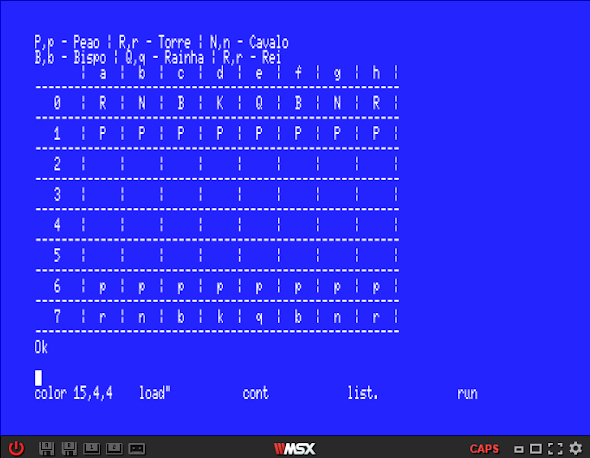

# Basic_Tuyama
- Pode-se encontrar o Pseudocódigo e o código em MSX BASIC nos links a seguir:

  [Pseudocódigo](https://github.com/ProgramacaoEE2020/Basic_Tuyama/blob/master/C%C3%B3digos/pseudoc%C3%B3digo_chess.docx) 

  [MSX BASIC](https://github.com/ProgramacaoEE2020/Basic_Tuyama/blob/master/C%C3%B3digos/msx_chess.txt)

- Como resultado, obtém-se o seguinte screenshot:

